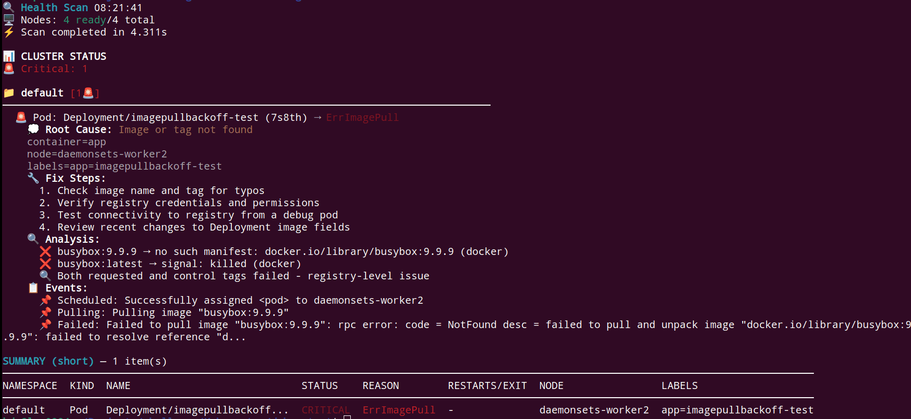
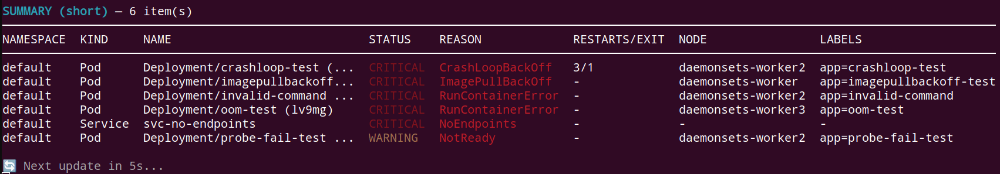

# kfast

**kfast** is a fast, lightweight Kubernetes troubleshooting CLI written in Go.  
Scan your cluster in seconds and spot issues like pod failures, CrashLoopBackOffs, misconfigurations, missing resources, and more — all in a single command.


---

## ✨ Features

- 🔍 One-shot cluster health scan  
- 📊 Clean table output with severity (🚨 Critical / ⚠️ Warning /)  
- 🚨 Detects common issues:
  - CrashLoopBackOff / ImagePullBackOff
  - Scheduling errors
  - Resource quota violations
  - Certificate/config issues
  - …and more
- 🖥️ Cross-platform: Linux, macOS, Windows

---

## ✅ Requirements

- **kubectl** configured and able to reach your cluster
- **Go** ≥ 1.22 (for building from source)

---

## 🚀 Installation

You can install **kfast** in several ways.

### 1) Quick Install (Linux/macOS)

```bash
git clone --depth 1 https://github.com/dmitrii-kalashnikov/kfast.git && cd kfast && sudo make install
```
> This will build and place the binary into `/usr/local/bin/kfast`.

### 2) Build Locally (All platforms)

```bash
git clone --depth 1 https://github.com/dmitrii-kalashnikov/kfast.git && cd kfast && go build -o kfast .

# Optionally move it into your PATH:
# sudo mv ./kfast /usr/local/bin/
```

### 3) Windows (Build Locally)

```powershell
git clone https://github.com/dmitrii-kalashnikov/kfast.git; cd kfast; go build -o kfast.exe .
# Add the repo folder (or the location of kfast.exe) to your PATH
```

### 🔄 Upgrade

- **Quick install users:** re-run the quick install command.  
- **Source users:** pull latest and reinstall:

```bash
cd kfast
git pull
sudo make install
```

### ❌ Uninstall

```bash
sudo make uninstall
```
> If you installed manually, remove the binary you placed on your PATH (e.g., `/usr/local/bin/kfast`).

---

## 🔧 Usage

Get help and all flags:

```bash
kfast --help
```

Run a full scan on the current context:

```bash
kfast
```

Run a full scan on live mode:

```bash
kfast -live
```

Sample output:



#### Summary table

---

## 🔐 RBAC

Read-only access is sufficient. If you need a minimal role, create a **ClusterRole** with `get/list/watch` for core resources (pods, nodes, events, configmaps, secrets metadata, etc.) and bind it to your user/service account.

---

## 🛠 Troubleshooting
 
- **Context issues**: Ensure `kubectl config current-context` points to the desired cluster.  
- **Missing metrics** (for any optional metrics-based checks): install or verify the Kubernetes Metrics Server.  
- **Permissions**: make sure your user has read access to cluster resources.

---

## 🤝 Contributing

PRs and issues are welcome! Please:
1. Open an issue describing the bug/feature.
2. Create a feature branch.
3. Add tests or sample output when applicable.
4. Submit a PR.

---

## 📄 License

MIT License. See `LICENSE` for details.